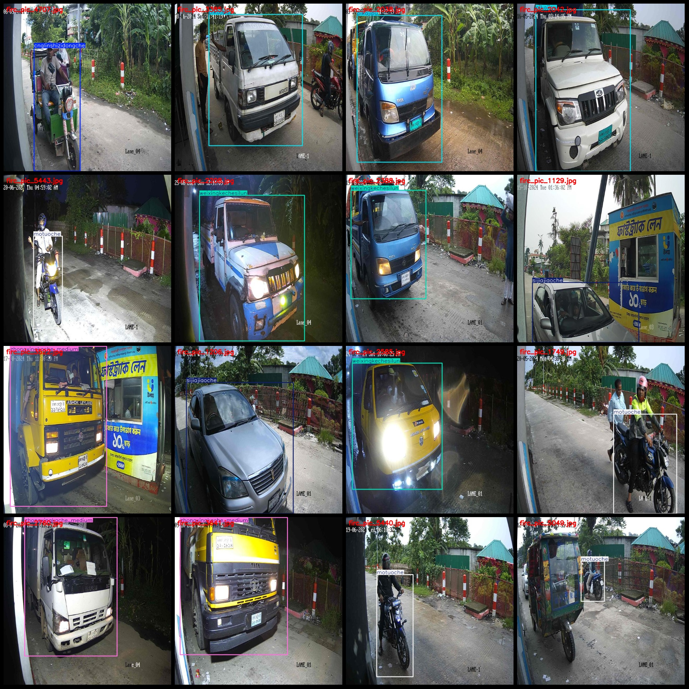
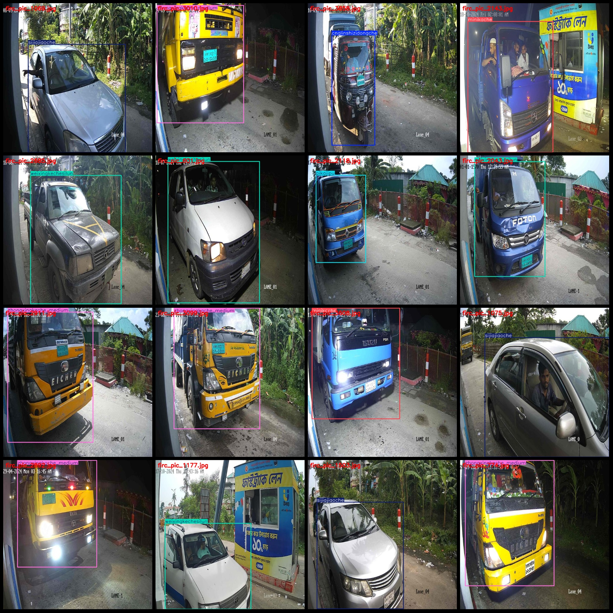

# 13-class vehicle detection dataset with 5895 images in VOC+YOLO format

Pascal VOC format + YOLO format (without split path in txtfile, only contain jpgimage and corresponding VOC format xmlfile and yolo format txtfile)
number of images: 5895  
annotation count: 5895  
annotation count: 5895  
annotationnumber of classes: 13  
Annotation class names: ["cnglinshizidongche", "daxingkeche", "minikache", "minikechekaositexing", "motuoche", "nongyongcheliang", "pikajipu", "renlichevan", "sijiajiaoche"]
"tuoche","weixingkechesilun","zhongxingkache_heavy","zhongxingkache_medium"]  
["CNG Temporary Auto", "Large Bus", "Mini Truck", "Mini Bus (Kashmiri)", "Motorcycle", "Agricultural Vehicle", "Pick-up Truck", "Human-powered/Van", "Private Car", "Truck", "Micro Bus (Four Wheels)", "Heavy Truck", "Medium Truck"]
boxes per class:   
CNG_LINSHIZIDONGCHE_FRAME_NUM = 1315
daxingkeche box count = 72  
minikache box count = 463  
minikechekaositexing box count = 7  
motuoche box count = 538  
Nongyongcheliang = 38
pikajipu box count = 675  
renlichevan box count = 255  
sijiajiaoche box count = 752  
tuoche box count = 14  
weixingkechesilun box count = 439  
zhongxingkache_heavy box count = 4  
zhongxingkache_medium box count = 1476  
Total frames: 6048
Category occupancy:
CNG Lin Shi Zidong Che occupies 1299 pictures.
daxingkeche images = 72  
minikache images = 461  
minikechekaositexing images = 7  
The number of pictures owned by Motuoche = 502.
nongyongcheliang images = 38  
pikajipu images = 674  
"renlichevan" is a Chinese name, and if you are asking for the number of images associated with it, that would be 246.
Sijiajiaoche owns 749 images.
Tuoche occupies the image count = 14
weixingkechesilun images = 437  
zhongxingkache_heavy images = 4  
zhongxingkache_medium images = 1468  
image resolution: 640x640  
Use annotation tool: labelImg.
Annotation rules: Draw a box around the category.
Important Note: The dataset does not have a separate training, validation, and test set. You will need to split it yourself.
Special Statement: This dataset does not guarantee the accuracy of the trained model or the weights file.
Image preview:
## Images

Here is a pay link on Stripe ( https://buy.stripe.com/3cs8yP7sY87d0vu9AB ). Please contact me lonlonago@foxmail.com after funding $89, and I will send you a complete data files , thank you!

